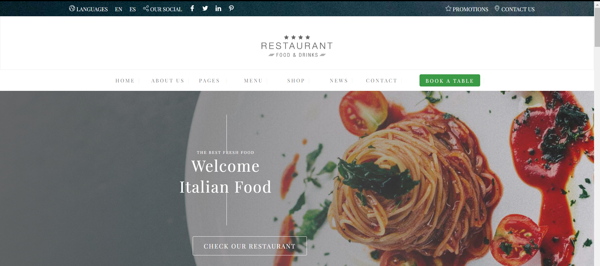

# Italian Restaurant Website

This repository contains the source code for a website built for an Italian restaurant.
The website offers various sections, including Home, About Us, Pages, Menu, Shop, News, and Contact,
providing users with information about the restaurant, its history, menu, merchandise, and news updates.
The website is designed to be visually appealing, responsive, and user-friendly, with a focus on 
reflecting the restaurant's branding and style. It's implemented using HTML and CSS .

**Key Features:**
- Responsive web design
- Detailed menu presentation
- Online merchandise shop
- News and events updates
- Contact form for inquiries and reservation
## Screenshots

## Technologies Used

- HTML
- CSS

## How to Run

 Click on this link [https://restaurant-project-html-css.onrender.com](https://restaurant-project-html-css.onrender.com)  to view the website in your web browser.

Feel free to explore the source code and adapt it for your own restaurant or similar projects.
